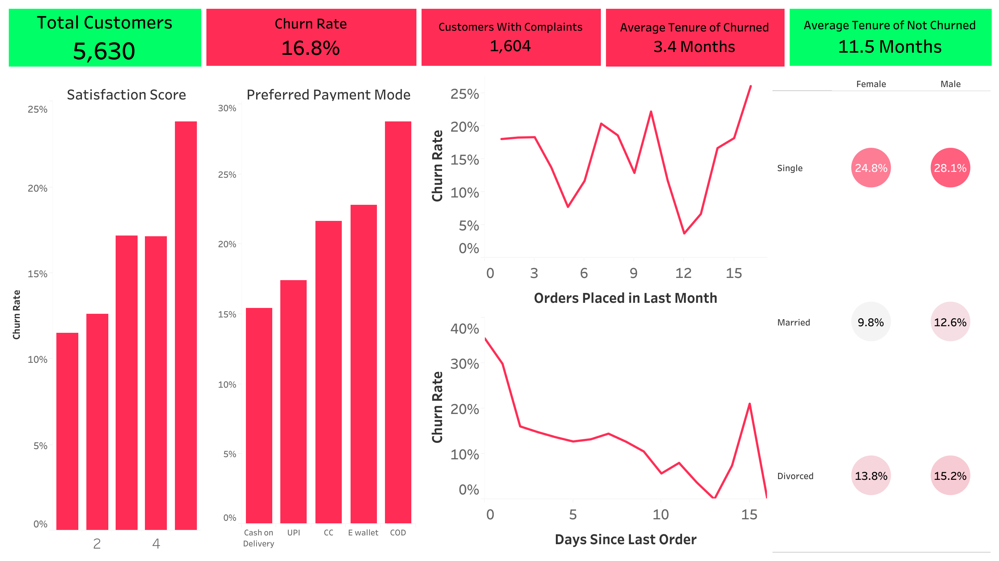

# 🛒 Customer Churn Analysis – E-Commerce Case Study

## 📌 Project Objective

The goal of this project is to explore customer churn behavior in an e-commerce business using SQL for querying, Python for exploratory data analysis (EDA), and Tableau for visualizing key trends. The findings will help identify at-risk customers and uncover behavioral patterns that drive churn, helping stakeholders make informed, data-driven decisions.

---

## 🧠 Business Problem

Customer churn is a critical metric for any subscription or retail-based company. Retaining existing customers is often more cost-effective than acquiring new ones. This project answers the following questions:

- What characteristics do churned customers share?
- How do behavior and satisfaction impact churn?
- Which segments have the highest churn rates?

---

## 📁 Dataset Description

**Source**: Simulated internal data  
**Size**: ~5,000 customers  
**Target Variable**: `Churn` (1 = churned, 0 = retained)

### Selected Variables

| Feature | Description |
|---------|-------------|
| `Tenure` | Months as a customer |
| `PreferredLoginDevice` | Device used to log in |
| `CityTier` | Tier of city (1 = top-tier) |
| `WarehouseToHome` | Distance to customer’s home |
| `PreferredPaymentMode` | Payment method |
| `HourSpendOnApp` | Average hours spent on app |
| `SatisfactionScore` | Score from 1–5 |
| `Complain` | Raised a complaint last month |
| `OrderCount`, `CouponUsed`, `CashbackAmount`, etc. | Behavior metrics |

---

## 🔧 Tools Used

| Tool     | Purpose                           |
|----------|-----------------------------------|
| **SQL**  | Data cleaning and transformation  |
| **Python** | Exploratory data analysis (Pandas, Seaborn, Matplotlib) |
| **Tableau** | Interactive visualizations & dashboards |

---

## 📊 Key EDA Insights

📉 Overall churn rate is 17%, signaling moderate customer loss risk.

🧓 Churned customers had significantly lower tenure:

3.38 months (churned) vs. 11.50 months (retained)

🏠 Distance from warehouse matters:

Churned customers lived farther away (17.13 vs. 15.35 units)

👨‍👩‍👧‍👦 Gender impact:

Males: 22% churn rate

Females: 18% churn rate

🎯 Satisfaction Score matters:

Churn rate rises with satisfaction score:

Score 1: 12%

Score 5: 24%

🛎️ Complaints strongly linked to churn:

No complaint: 11% churn

Complained: 32% churn

⏳ Day since last order:

Churned: 3.24 days

Retained: 4.81 days

This histogram shows that lower satisfaction scores are associated with higher churn rates.

Correlation heat map of all variables in the data set. The three variables with the strongest correlation to churn are: tenure (-0.35), complaint (0.25) and days since last order (-0.16).

---

## 📈 Tableau Visualizations

## 🔍 Key Findings
Overall Churn Rate: 17%, indicating a moderate level of customer loss risk.

Tenure: Churned customers had significantly shorter tenure (3.38 months) than retained customers (11.50 months).

Complaints: Customers who filed complaints were nearly 3x more likely to churn (32% vs. 11%).

Satisfaction Score: Higher satisfaction scores were unexpectedly associated with higher churn, warranting further investigation into expectation vs. experience.

Distance to Warehouse: Churned users lived farther from fulfillment centers, suggesting a potential service or logistics gap.

Gender: Males exhibited a higher churn rate (22%) compared to females (18%).

## 💡 Strategic Implications
Early Tenure Engagement: Prioritize onboarding and nurturing customers within their first 3–4 months.

Complaint Resolution: Invest in faster and more personalized complaint handling processes.

Logistics Optimization: Analyze delivery pain points for customers far from warehouses.

Customer Segmentation: Develop tailored marketing or loyalty programs for high-risk segments identified through behavior patterns.

---
